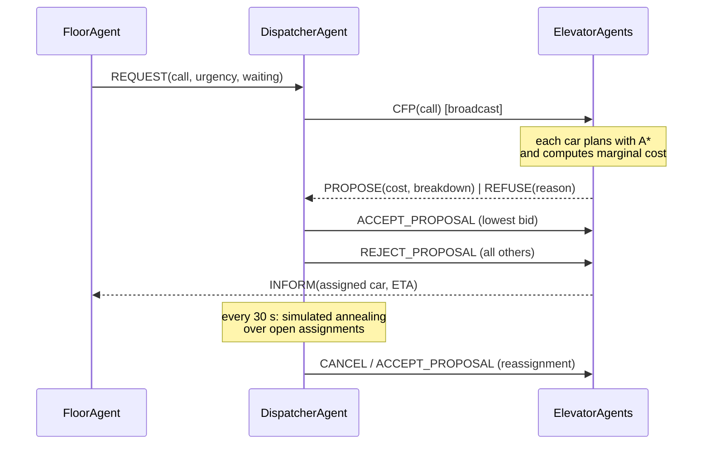

# Design

Multi-Agent Smart Elevator Fleet Coordinator — *Fundamentals of AI* case study
(Russell & Norvig, *Artificial Intelligence: A Modern Approach*, 4th edition).

---

## 1. The problem

A building of *N* floors is served by *M* lift cars. Passengers appear at unpredictable
times, press a hall button, and only reveal where they are going *after* they board. The
system must decide, continuously, which car serves which call and in what order — while
cars break down, alarms sound, and demand changes shape through the day.

This is a good case study because the obvious greedy answer ("send the nearest car") is
measurably poor, and because almost every technique in the first half of AIMA earns its
place naturally rather than being bolted on.

---

## 2. PEAS

### 2.1 System level

| | |
| --- | --- |
| **Performance** | Average, 95th-percentile and maximum wait; ride and system time; percentage of waits over 60 s; throughput; energy (floors travelled, stops, reversals); zero safety violations; fairness — no starved call. |
| **Environment** | A multi-storey building: floors with up/down hall buttons and occupancy sensors, shafts, the cars, the passengers, and the other cars each car competes with. |
| **Actuators** | Car motors (up / down / stop), doors (open / close / hold), hall lanterns and car displays, and FIPA-ACL messages on the bus. |
| **Sensors** | Position encoders, load and door sensors, car and hall buttons, per-floor occupancy sensors, and the message inbox. |

The performance measure is deliberately **multi-objective and partly adversarial**:
minimising energy alone would park every car and let people wait; minimising average wait
alone would run cars constantly and allow one unlucky floor to starve. This is exactly why
the cars are utility-based rather than goal-based, and why fairness is enforced separately
by the aging mechanism rather than hoped for as a side effect.

### 2.2 Per agent

| Agent | AIMA type | Performance | Environment | Actuators | Sensors |
| --- | --- | --- | --- | --- | --- |
| **PassengerAgent** | Simple reflex | own wait, ride, being delivered | its floor, hall buttons, arriving cars | press hall button, board, press car button, alight | car presence, direction, door state, space |
| **FloorAgent** | Model-based reflex | wait of its callers, no starved call | the landing, waiting passengers, shafts, cars | hall lamps, lanterns, REQUEST messages | hall buttons, occupancy sensor, arrivals, messages |
| **ElevatorAgent** | Goal-based **and** utility-based | wait/ride served, energy, capacity and door safety | its shaft, floors, its passengers, other cars | motor, doors, car-button lamps, messages | position encoder, load, door sensor, car buttons |
| **DispatcherAgent** | Utility-based coordinator (auctioneer) | fleet AWT/P95, % long waits, fairness, fault recovery | all floors, all cars, open calls, traffic pattern | CFP / ACCEPT / REJECT / CANCEL, parking orders | REQUESTs, PROPOSEs, REFUSEs, FAILUREs, advice |
| **TrafficMonitorAgent** | Learning | rate-estimate and classification accuracy, resulting AWT | the arrival stream across all floors | INFORM the dispatcher of weights and parking policy | observed arrivals per floor and direction |
| **SafetyAgent** | Knowledge-based (logical) | zero safety violations, correct recall, nobody stranded | car loads, doors, fault states, alarm lines | recall, hold/reopen doors, out-of-service, block calls | load, door and fault sensors, fire-alarm input |

### 2.3 Why each agent is the type it is

This is the question most likely to be asked in the viva, so the reasoning is explicit.

- **Passenger — simple reflex.** Its entire policy is a condition-action rule: *if a car
  is here, its doors are open, it serves my direction and there is room, board*. It keeps
  no model and plans nothing. Making it anything more would be modelling a commuter's
  strategy, not a lift system.

- **Floor — model-based reflex.** A simple reflex agent **cannot** do this job. The right
  action depends on history that is absent from the current percept: has this call already
  been requested, and how long has it been outstanding? So the agent maintains internal
  state (`active_calls`, `call_since`, `assigned_car`) and updates it from percepts. That
  is the textbook definition of the model-based extension, and it is what makes the
  fairness guarantee possible.

- **Elevator — goal-based *and* utility-based.** *Goal-based* because it holds a set of
  stops it must reach and **searches** for an action sequence that achieves them; change
  the goals and behaviour follows without rewriting a rule. *Utility-based* because
  "achieve the goals" does not say which plan to prefer, and the candidate plans differ in
  kind: one is quicker for those aboard, another kinder to the crowd downstairs, another
  cheaper in electricity. A scalar utility is needed to trade them off, and that same
  function is what the car bids with.

- **Dispatcher — utility-based coordinator.** Note that it is *not* a central controller.
  It never commands a car; it asks, the cars answer with their own costs, and it awards.
  That is what makes a car failure degrade the fleet gracefully instead of invalidating a
  central plan.

- **Traffic monitor — learning agent.** It has all four AIMA components: the *performance
  element* (the dispatcher and cars), the *critic* (observed arrivals), the *learning
  element* (EWMA rate estimation) and the *problem generator* (the pattern classifier,
  which proposes a different policy to try). Demand is genuinely unknown to the agents —
  only the hidden generator knows the true rate — so this is real learning, not parameter
  reading.

- **Safety — knowledge-based.** Its behaviour is not procedural code but a declarative
  rule base plus an inference engine. This matters for safety specifically: the rules can
  be audited as knowledge by someone who does not read Python, every action is traceable
  to the rule and bindings that caused it, and priority between competing rules is
  explicit in `salience` rather than implicit in statement order.

---

## 3. Environment classification

| Dimension | Classification | Justification |
| --- | --- | --- |
| Observability | **Partially observable** | A passenger's destination is private until they board and press a car button, so the dispatcher must commit a car to a call *before* knowing where that call is going. Each agent also sees only its own sensors and inbox. |
| Agents | **Multi-agent, cooperative** | Cars bid against one another in auctions, but they are scored on one shared fleet objective, so competition is a mechanism for allocating work rather than a conflict of interest. |
| Determinism | **Stochastic** | Poisson arrivals with a time-varying rate, plus injected faults. Given a seed the run replays exactly, which makes the stochasticity *reproducible* rather than uncontrolled. |
| Episodes | **Sequential** | Assigning a call now changes which car is well placed for the next ten minutes of calls. |
| Change | **Dynamic** | Passengers keep arriving while the agents deliberate, so a plan can be stale before it executes. This is why replanning is event-driven and closed-loop. |
| Values | **Discrete** (discretised from continuous) | Floors and one-second ticks, abstracted from genuinely continuous motion. The frontend interpolates between ticks, so the animation is smooth without the engine having to model continuous dynamics. |
| Knowledge | **Known physics, unknown demand** | The agents know exactly how long a car takes to move a floor or cycle its doors; they do not know the arrival rates, which must be learned online. |

The two consequences that shape the whole design are **partial observability** (bid before
you know the destination, then replan on boarding) and **dynamism** (never trust a cached
plan across an event).

---

## 4. Architecture

```
Poisson arrivals (hidden rate)        Scenario YAML (floors, cars, timings, events)
            │                                        │
            ▼                                        ▼
 ┌──────────────────────┐                ┌────────────────────────┐
 │  PassengerAgent      │ simple reflex  │      ElevatorModel     │
 │  (arrive/board/exit) │                │  staged activation:    │
 └──────────┬───────────┘                │  sense→…→negotiate→act │
            │ presses hall button        └────────────┬───────────┘
            ▼                                         │
 ┌──────────────────────┐  REQUEST                    │
 │  FloorAgent × N      ├──────────────┐              │
 │  model-based reflex  │              │              │
 │  + aging / fairness  │◄───┐         ▼              ▼
 └──────────────────────┘    │  ┌────────────────┐ ┌──────────────────┐
                        INFORM  │ DispatcherAgent│ │  SafetyAgent     │
                             │  │  auctioneer    │ │  forward chaining│
 ┌──────────────────────┐    │  │  CNP + SA      │ │  R1…R7           │
 │  ElevatorAgent × M   │◄───┴──┤  + parking     │◄┤  overrides all   │
 │  goal + utility      │  CFP  └───────┬────────┘ └──────────────────┘
 │  A* stop sequencing  ├───────────────┘                   ▲
 │  marginal-cost bids  │  PROPOSE / REFUSE                 │ faults, alarms
 └──────────────────────┘                                   │
                             ┌──────────────────────┐       │
                             │ TrafficMonitorAgent  ├───────┘
                             │ learning: EWMA rates │  INFORM: weights,
                             │ + pattern rules      │  parking policy
                             └──────────────────────┘
```

### 4.1 The tick, and why the stages are fixed

One tick is one simulated second, executed in staged activation: each stage is completed
by every agent of a type before the next begins.

```
sense → communicate → negotiate → decide → act → learn → collect metrics
                     (announce → bid → award → commit, repeated per open call)
```

`negotiate` is the Contract Net, run as short sub-stages inside the tick: the dispatcher
announces a CFP, every car reads it from **its own inbox** and replies, the dispatcher
awards, and the winning car reads the award and commits. It repeats until no call is
waiting for a decision (one call per round), so a burst of arrivals is settled within the
same tick instead of leaving passengers waiting for the next one. `learn` is a hook that
is empty today; the LiftZero network will use it to record outcomes.

Within a tick every agent senses the **same** world state before anyone acts on it. Without
that, results would depend on activation order rather than on the agents' reasoning, and
the run would not be reproducible. The SafetyAgent runs its whole cycle before the
dispatcher's, because safety overrides coordination: if an alarm is raised this tick, hall
calls are already blocked before any auction could award one.

**The one rule of interaction.** No agent calls another agent's methods. It influences
others only by sending messages, which the receiver reads from its own inbox on its own
turn, and it learns about others only from messages and from the **status board**: a shared
blackboard of public facts (each car's floor, load, door state, assigned calls, planned end
of route; the fleet's current weights and demand estimate). Only the owner writes its own
entry, and entries are immutable snapshots. `tests/test_messaging.py` enforces the rule with
a spy that fails if a dispatcher or safety method is ever on the call stack of a car's bid,
accept, drop or out-of-service routine.

### 4.2 Module layout

```
src/elevator_mas/
  domain.py        value types (Direction, Stop, HallCall, Bid, …)
  config.py        pydantic models loaded from the scenario YAML
  model.py         the Mesa Model: staged activation, wiring, DataCollector
  agents/          the six agent types, one module each
  comms/           FIPA-ACL Message + the logging MessageBus
  planning/        generic SearchProblem, the four algorithms, car routing
  optimization/    simulated annealing, hill climbing, minimax + alpha-beta
  strategies/      the pluggable dispatch strategies (registry)
  traffic/         Poisson arrivals and the origin-destination profiles
  rules/           the forward-chaining engine and the safety rule base
  metrics.py       metric definitions and aggregation
  sim/             headless runner and benchmark harness
  api/             FastAPI REST + WebSocket
  web/             single-page vanilla HTML/CSS/JS + Canvas dashboard
```

The engine never imports from `api/` or `web/`: the UI is strictly a consumer, which is
what lets the whole benchmark run headless.

---

## 5. Agent communication

Messages follow **FIPA-ACL** (AIMA §2.4.4): a performative saying what the speech act
*does*, plus sender, receiver, a `conversation_id` threading one protocol round together,
content and tick. Nine performatives are used: `REQUEST`, `CFP`, `PROPOSE`, `REFUSE`,
`ACCEPT_PROPOSAL`, `REJECT_PROPOSAL`, `INFORM`, `CANCEL`, `FAILURE`.

Delivery is queue-based rather than a direct method call. Agents only ever read their own
inbox, which keeps the multi-agent interaction real — and visible — instead of a hidden
function call. Every message is logged. Besides the auction, the same channel carries
**orders**: the SafetyAgent supervises the fleet with `REQUEST` messages whose content
holds an `Order` (`FIRE_RECALL`, `HOLD_DOORS_OPEN`, `REFUSE_BOARDING`, `REOPEN_DOORS`,
`OUT_OF_SERVICE`, `RETURN_TO_SERVICE`, `BLOCK_HALL_CALLS`, `RESTORE_SERVICE`), and the
cars and the dispatcher obey on their own turn.

### 5.1 Contract Net, per hall call

```
FloorAgent        DispatcherAgent        ElevatorAgent(s)          FloorAgent
    │                    │                      │                      │
    │── REQUEST ────────▶│                      │                      │
    │   (call, urgency)  │── CFP (broadcast) ──▶│                      │
    │                    │             [each car, from its own inbox,
    │                    │              plans with A* and
    │                    │                  prices the marginal cost of
    │                    │                  inserting the call]
    │                    │◀── PROPOSE (cost) ───│ available cars       │
    │                    │◀── REFUSE (reason) ──│ full / OOS / fire    │
    │                    │── ACCEPT_PROPOSAL ──▶│ lowest bidder        │
    │                    │── REJECT_PROPOSAL ──▶│ the others           │
    │◀──────────────────────── INFORM (ETA) ────│ winner lights the    │
    │                    │                      │ hall lantern         │
    │      every 30 s:   │ SA re-optimises open assignments            │
    │                    │── CANCEL ───────────▶│ losing car           │
    │                    │── ACCEPT_PROPOSAL ──▶│ gaining car          │
```

As a Mermaid sequence diagram:



The whole round happens inside the `negotiate` stage of one tick, so a caller is never left
waiting several seconds while the fleet deliberates. Every step is a real message that a
car reads from its own inbox; the dispatcher never computes a bid on a car's behalf. Each
award also gets a one-line **decision trace** (`AuctionRound.reason`), for example which
car won, by how much, and what the runner-up would have cost, shown in the dashboard.

Failure handling is also by message. A car that is faulted between bidding and being
awarded answers the award with `FAILURE` and the calls are re-auctioned; an
`OUT_OF_SERVICE` order makes the car hand its calls back the same way. Reassignment by
simulated annealing sends `CANCEL` to the car that loses a call and `ACCEPT_PROPOSAL`
(reason "global reassignment") to the car that gains it.

---

## 6. Algorithms

### 6.1 Car routing as state-space search

The core AIMA modelling contribution. Formulated per §3.1:

- **State** `(current_floor, frozenset of pending stops)`, where a stop is a pickup
  `(floor, direction, weight = people waiting)` or a drop-off `(floor, weight = riders)`.
  Same-floor stops of the same kind are merged before searching, so a single stop really
  is a single door cycle.
- **Actions** "go and serve one pending stop". The branching factor is the number of
  *legal* pending stops, not the number of floors — which is what keeps the state space
  small enough for A* to be exact in practice.
- **Transition model** serving a stop moves the car to that floor and removes the stop.
- **Goal test** no pending stops.
- **Step cost** `(travel + dwell) × total weight of still-unserved stops`, plus an energy
  term.

#### Why that step cost

It telescopes. Charging each step by the weight of everything *still* pending means that,
summed along a path,

```
Σ steps  =  Σ_i (weight_i × arrival_time_i)  +  energy
```

so path cost is total **passenger-seconds**. Minimising it minimises aggregate waiting
rather than distance driven — the optimal path is the one that relieves the most people
soonest, and a heavier stop (a crowd, or a priority passenger weighted ×3) is naturally
served earlier with no special-case code.

#### Legality: collective control

Two constraints, both necessary:

1. **Never carry a rider backwards.** With riders aboard, a pickup `(f, UP)` is legal only
   if `cur ≤ f ≤ every pending drop-off` (mirrored for DOWN).
2. **Serve a call in the direction it asked for.** A DOWN call may only be taken once no
   pickup lies further up, so the car climbs to the top of its sweep and then descends
   through the calls.

Constraint 2 was discovered by measurement, not by design: without it A* would plan
`8↓, 11↓, 12↓, 14↓` from floor 7 — boarding four *down*-travelling passengers while driving
*upwards*, carrying each away from their destination. Every pickup looked cheap because it
was "on the way". It made down-peak traffic perform **worse than the reflex baseline**, and
fixing it is what brought the full strategy back ahead. It is asserted in
`tests/test_search.py::TestCollectiveLegality`.

#### The heuristic

```
h(state) = Σ_i w_i · travel(cur, f_i)  +  energy_lower_bound(line span)
```

**Admissible.** Two independent lower bounds on disjoint parts of the true cost:

1. *Weighted travel.* Every pending stop must eventually be reached, and cannot be reached
   faster than travelling straight to it, so it costs at least `w_i · travel(cur, f_i)`.
   Dwell time and the delay other stops inflict are both dropped, which can only lower the
   estimate.
2. *Energy line span.* The car must visit the lowest and the highest pending floor, so it
   travels at least the span of that line through its current position, and must open its
   doors at least once per remaining stop.

Neither bound double-counts the other's cost, so their sum is still a lower bound on the
true remaining cost. Therefore `h ≤ h*`, and A* is optimal.

**Consistent.** For any legal transition `s --a--> s'` serving stop *j*:

- The travel term loses `w_j · travel(cur, f_j)` exactly, and each remaining term can grow
  by at most `w_i · travel(cur, f_j)` by the triangle inequality on a line. The step cost
  charges `(travel + dwell) × Σ_{still pending} w_i`, which covers both.
- The energy term's span can only shrink or stay equal, and the step pays
  `energy_per_floor × |f_j − cur| + energy_per_stop`.

Hence `h(s) ≤ c(s, a, s') + h(s')`. Consistency implies A* never re-expands a node and
expands no more nodes than UCS — which the tests assert numerically over 200 random
instances (admissibility, consistency, `A* cost == UCS cost`, `A* expansions ≤ UCS`).

**Measured on a live 7-stop instance:** BFS 401 nodes expanded, UCS 98, **A\* 41**, all
three at the optimal cost 375; Greedy expanded only 7 but returned 589 — 57 % worse.

#### Bounded rationality

Above 10 pending stops the search is abandoned for a **LOOK sweep** (serve everything ahead
in the current direction, reverse, sweep back). This is AIMA §3.6's bounded rationality:
the optimal computation is not worth its cost at every tick under real-time constraints.
It is O(n log n) instead of exponential, it is what real controllers do, and it is why
`stress_scale` (40 floors, 8 cars, a simulated hour) finishes in ~2.5 s.

Replanning is **event-driven**, not per tick: a car replans only when its goal set actually
changes (a call won or cancelled, someone boards or alights, a fault occurs).

### 6.2 Bidding — the utility function

A car's bid is the **marginal cost** of inserting the call into its existing plan: plan
with and without it, and take the difference. That makes it a true opportunity cost — a car
already passing the floor bids nearly nothing, one that would have to reverse bids a lot.
It is exactly the information the auction needs.

```
bid = W1·wait + W2·ride + W3·crowding + W4·energy   −   urgency · escalation_bonus
```

W1–W4 are swapped wholesale by the TrafficMonitorAgent when the traffic pattern changes,
so the learning agent's output is not a number on a dashboard but a *different dispatching
policy*.

### 6.3 Local search (AIMA §4.1)

Contract Net commits each call greedily the moment it appears, so the global assignment
drifts out of shape as traffic changes. Every 30 s the dispatcher runs **simulated
annealing** over the assignment of calls nobody has picked up yet — the classic local
search setting: a large discrete space where only the final configuration matters.

- **State** a map from hall call to car. **Neighbours** move one call, or swap two.
- **Objective** summed insertion-cost estimate, with a quadratic load term to spread work
  and an aging term so the optimiser also fights starvation.
- **Acceptance** `exp(−ΔE / T)` with geometric cooling; the *best* configuration ever seen
  is tracked separately and returned, so **the result can never be worse than the input** —
  asserted in the tests, and what makes it safe to run on a live fleet.
- **Hysteresis (80).** A reassignment is adopted only if it beats the incumbent by that
  margin. Without it the fleet reshuffles constantly for fractions of a second of gain and
  passengers watch their hall lantern flicker between cars. The value was tuned by
  measurement (see `docs/TESTING.md`).

**Hill climbing with random restarts** is used for idle-car parking, minimising expected
response `Σ_f λ_f · min_c |p_c − f|` using the rates the monitor learned online. The plain
hill-climbing variant over assignments is kept for the Search Lab comparison, where it
visibly flattens earlier and higher than the annealing curve.

### 6.4 Adversarial search (AIMA ch. 5)

Hill-climbing parking optimises the *expected* response and says nothing about the worst
case — it will happily leave a whole wing uncovered if that wing is quiet. So parking can
instead be posed as a two-player game:

- **MAX** (the dispatcher) chooses where to park the idle cars.
- **MIN** ("nature") then chooses the floor the next hall call appears on, picking the one
  that hurts most among the plausible floors.
- **Utility** negative distance from the nearest parked car to that call.

The minimax value is therefore a **guarantee**: whatever floor calls next, the response
distance is no worse than this. **Alpha-beta** returns the identical value while visiting
far fewer nodes — measured at **105 → 47 nodes, a 55 % saving**, with the equality asserted
in the tests and shown live in the Search Lab.

Nature is modelled as an adversary rather than as chance deliberately: it yields a
worst-case bound and is the clean textbook illustration. The expectimax alternative is
discussed in `docs/VIVA_QA.md`.

### 6.5 Knowledge-based reasoning (AIMA ch. 7 & 9)

The SafetyAgent asserts what it senses into working memory and **forward-chains** over a
declarative rule base until no further conclusion follows. Rules fire in salience order:

| Salience | Rule | Production |
| --- | --- | --- |
| 100 | `R1_fire_recall` | IF fire_alarm AND car in service THEN recall to lobby |
| 90 | `R2_fire_doors_open` | IF fire_alarm AND car at lobby THEN hold doors open |
| 80 | `R3_block_hall_calls` | IF fire_alarm THEN block all hall calls |
| 70 | `R4_car_fault_out_of_service` | IF car_fault THEN out of service AND re-auction its calls |
| 60 | `R5_overload_refuse_boarding` | IF load > capacity THEN hold doors AND refuse boarding |
| 50 | `R6_door_obstruction` | IF doors blocked too long THEN re-open |
| 40 | `R7_fire_cleared` | IF NOT fire_alarm AND cars recalling THEN restore service |

Adding a safety policy means adding a rule, not editing the agent. The same rules are
mirrored as Horn clauses in [`safety_rules.pl`](safety_rules.pl), which can be run under
SWI-Prolog to confirm the two formulations entail the same conclusions — the knowledge is
independent of the inference procedure.

### 6.6 Complexity

| Component | Complexity | In practice |
| --- | --- | --- |
| A* routing | O(b^d) worst case, b = legal stops ≤ 10 | 41 nodes on a live 7-stop instance |
| LOOK fallback | O(n log n) | used above 10 stops |
| Contract Net round | O(M · A*) | 4 cars × one plan each |
| Simulated annealing | O(iterations × |calls|) = O(400 · k) | ~1 ms, every 30 s |
| Hill-climbing parking | O(restarts × iters × M × |demand|) | 6 restarts |
| Minimax + alpha-beta | O(C(s+m−1, m) · f), pruned in practice | 105 → 47 nodes |
| Forward chaining | O(passes × rules × bindings), fixed point | ≤ 16 passes |
| **Whole tick** | — | **0.14 ms** (15 floors/4 cars), **4.6 ms** (40 floors/8 cars) |

---

## 7. Tool selection

| Tool | Why | Alternatives rejected |
| --- | --- | --- |
| **Python 3.12 via uv** | One command (`uv sync`) fetches the interpreter *and* the pinned dependencies, so the demo laptop's system Python 3.10 is irrelevant. Lockfile makes the run reproducible. | Bare `pip`/`venv` — cannot install an interpreter, so the demo machine would need manual setup. Conda — heavier, slower, another thing to install. |
| **Mesa 3.x** | The standard Python ABM framework: `Agent`/`Model`, seeded RNG and `DataCollector` for free, and the staged-activation idiom fits the sense→act tick exactly. Being a recognised ABM framework is itself worth marks. | Raw Python classes — would mean re-implementing agent registration, seeding and data collection. SPADE — genuinely FIPA-compliant but needs a running **XMPP server**, which is a hard dependency to demo. JADE — Java, wrong ecosystem. |
| **FastAPI + uvicorn** | Native WebSocket support for streaming a frame per tick, plus REST for control and automatic validation through the same pydantic models the config uses. | Flask — WebSockets need extra extensions. Django — far too heavy for a single-page dashboard. |
| **pydantic + PyYAML** | One schema validates the scenario files *and* the API bodies, so a malformed YAML fails at load with a clear message rather than deep inside a run. | `dataclasses` + manual checks — more code, worse errors. |
| **Vanilla HTML/CSS/JS + Canvas** | No build step at all: clone, `uv sync`, run. Canvas draws 15 shafts at 60 fps trivially, and the interpolation that makes a 1 Hz simulation look smooth is ~20 lines. | React/Vue — a toolchain, `node_modules` and a build step to maintain and to fail during a demo. |
| **Chart.js, vendored** | Charts without a CDN dependency — the demo works with the network unplugged. | Plotly/D3 — much larger; D3 would need far more code for these charts. |
| **pandas + matplotlib** | `groupby(...).agg(["mean","std"])` is the benchmark table; matplotlib with the Agg backend writes slide-ready PNGs headlessly. | Hand-rolled statistics — error-prone and unnecessary. |
| **pytest + coverage** | Parametrised property tests over hundreds of seeded random instances, which is how the A*/heuristic claims are actually established. | `unittest` — far more boilerplate for the same properties. |
| **ruff** | Lint and format in one fast tool, so style is uniform without argument. | black + flake8 + isort — three tools where one suffices. |

Two rejections worth stating explicitly, because they are the obvious alternatives for
this exact project:

- **pygame** — good at animation, but offers no dashboard: no tables, no charts, no
  message log, no side panels. Four of this project's five deliverable surfaces would have
  to be built from scratch.
- **Streamlit** — excellent for static dashboards, but it re-runs the whole script on every
  interaction, so a continuously animating simulation with a WebSocket stream fights the
  framework rather than using it.

---

## 8. Scalability

Floors, cars, capacity, timings, traffic profile, events, cost weights and planner limits
all come from YAML. `stress_scale` (40 floors, 8 cars, capacity 12) is **only a
configuration file** — no code differs from the 15-floor default. It simulates a full hour
in ~2.5 s, at 4.6 ms per tick.

What keeps it fast: event-driven replanning (not per tick), the bounded-rationality LOOK
fallback above 10 stops, retirement of delivered passenger agents (their records stay with
the collector, so metrics remain complete), and bounded message and rule logs.

New dispatch strategies are added through the registry without touching the agents; new
safety policies are added as rules without touching the SafetyAgent.

---

## 9. Work split (team of 4)

| Member | Owns | Deliverables |
| --- | --- | --- |
| **A — Environment & agents** | `model.py`, `agents/`, `traffic/`, `config.py` | The six agents with their PEAS docstrings, staged activation, the Poisson arrival model, the scenario schema. Answers agent-type and environment-classification questions. |
| **B — Search & optimisation** | `planning/`, `optimization/` | The generic `SearchProblem`, BFS/UCS/Greedy/A*, the routing formulation, the heuristic and its proofs, SA, hill climbing, minimax + alpha-beta. Answers algorithm and complexity questions. |
| **C — Coordination & knowledge** | `comms/`, `agents/dispatcher.py`, `rules/`, `safety_rules.pl` | FIPA-ACL messaging, the Contract Net protocol, global reassignment, the forward-chaining engine and the safety rule base. Answers protocol and knowledge-representation questions. |
| **D — Interface, experiments & docs** | `api/`, `web/`, `sim/`, `docs/`, `reports/` | The dashboard's four tabs, the REST/WebSocket layer, the benchmark harness and charts, the documentation set. Drives the live demo. |

Testing is shared: each member writes the tests for the module they own, and the invariant
tests in `tests/test_simulation.py` are written jointly, since they constrain everybody.
